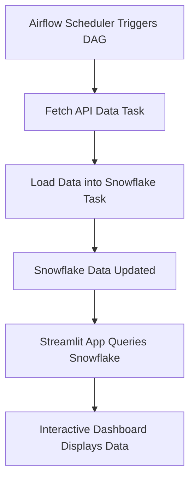

# API-PULL-VIA-AIRFLOW-TO-SNOWFLAKE-WITH-STREAMLIT-VISUALIZATION

## Overview

This project provides an end-to-end solution that:
- **Fetches data from an API** using Apache Airflow.
- **Loads the data into Snowflake** as a centralized data warehouse.
- **Visualizes the data interactively** with a Streamlit dashboard.

The system is designed to update data automatically on a scheduled basis, ensuring that the visualizations always reflect the latest information.

## Workflow

Below is a high-level workflow diagram illustrating the process:



**Workflow Description:**
1. **Airflow Scheduler Triggers DAG:**  
   The Airflow scheduler initiates the DAG at the configured interval (daily by default).

2. **Fetch API Data Task:**  
   The DAG fetches data from a public API.

3. **Load Data into Snowflake Task:**  
   The fetched data is loaded into a Snowflake table, updating the warehouse with the latest information.

4. **Snowflake Data Updated:**  
   With the new data available in Snowflake, the dataset becomes the source for our visualizations.

5. **Streamlit App Queries Snowflake:**  
   The Streamlit dashboard directly connects to Snowflake to retrieve the updated data.

6. **Interactive Dashboard Displays Data:**  
   The Streamlit app displays:
   - A full data table.
   - Analysis of average immunization measures by region and year.
   - A grouped histogram showing performance over the years with custom colors.

## Project Structure

```
project_root/
├── airflow/
│   ├── dags/
│   │   └── api_to_snowflake.py         # Airflow DAG for fetching API data and loading it into Snowflake.
│   └── .env                           # Environment file with Snowflake credentials (DO NOT COMMIT SENSITIVE INFO).
├── streamlit_app/
│   ├── snowflake_query.py             # Module to query Snowflake and return a DataFrame.
│   └── app.py                         # Streamlit application for interactive visualizations.
├── requirements.txt                   # List of Python dependencies.
└── README.md                          # Project documentation.
```

## Prerequisites

- **Python 3.7+**
- **Snowflake Account:** Ensure you have valid credentials.
- **Apache Airflow:** Installed and configured.
- **Streamlit:** For running the interactive dashboard.

## Installation

1. **Clone the Repository:**

   ```bash
   git clone https://github.com/waitambatha/API-PULL-VIA-AIRFLOW-TO-SNOWFLAKE-WITH-STREAMLIT-VISUALIZATION.git
   cd API-PULL-VIA-AIRFLOW-TO-SNOWFLAKE-WITH-STREAMLIT-VISUALIZATION
   ```

2. **Set Up a Virtual Environment and Install Dependencies:**

   ```bash
   python -m venv venv
   source venv/bin/activate  # On Windows: venv\Scripts\activate
   pip install -r requirements.txt
   ```

3. **Configure Environment Variables:**

   Create a `.env` file in the `airflow/` directory with your Snowflake credentials:
   
   ```
   SNOWFLAKE_USER=your_username
   SNOWFLAKE_PASSWORD=your_password
   SNOWFLAKE_ACCOUNT=your_account
   SNOWFLAKE_WAREHOUSE=your_warehouse
   SNOWFLAKE_DATABASE=your_database
   SNOWFLAKE_SCHEMA=your_schema
   ```

## Usage

### Running the Airflow DAG

1. **Place the DAG:**
   Ensure `api_to_snowflake.py` is in your Airflow DAGs folder.

2. **Start Airflow:**
   In separate terminals, start the Airflow webserver and scheduler:

   ```bash
   airflow webserver -p 8080
   airflow scheduler
   ```

3. **Monitor the DAG:**
   The DAG is scheduled to run daily (by default) to fetch data and load it into Snowflake.

### Running the Streamlit App

1. **Navigate to the Streamlit Directory:**

   ```bash
   cd streamlit_app
   ```

2. **Run the Application:**

   ```bash
   streamlit run app.py
   ```

3. **Interact with the Dashboard:**
   Your default web browser will open, showing:
   - The full data table.
   - Analysis of average immunization measures by region and year.
   - A grouped histogram with custom colors (blue, red, green) for each year.

## Customization

- **API Endpoint:**  
  Modify the API URL in `api_to_snowflake.py` if you wish to pull data from another source.

- **Visualization Settings:**  
  Adjust the charts in `app.py` (colors, chart types, filters) to tailor the dashboard to your needs.

- **DAG Schedule:**  
  Change the `schedule_interval` in the Airflow DAG to run the ETL process more or less frequently.
